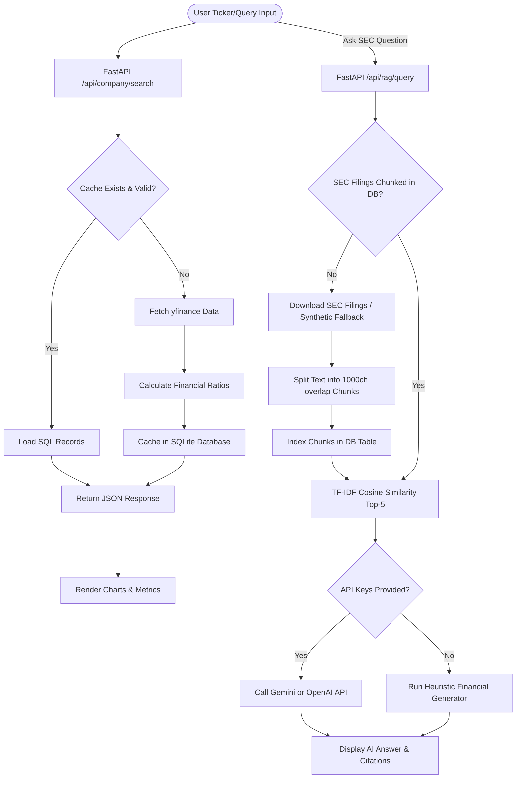

# Walkthrough - AI Financial Research Assistant

The project is fully implemented! Below is a summary of the modules, file structure, test outputs, and execution instructions.

## What Was Built

We created a high-fidelity **AI Financial Research Assistant** containing 12 distinct functional modules served entirely in a clean, zero-configuration Python stack.

### Folder Structure
All resources are located in the `c:\Users\sanat\OneDrive\Desktop\PROJECTS\ai-financial-research-assistant` workspace:

- [requirements.txt](file:///c:/Users/sanat/OneDrive/Desktop/PROJECTS/ai-financial-research-assistant/backend/requirements.txt): Environment dependencies.
- [run.py](file:///c:/Users/sanat/OneDrive/Desktop/PROJECTS/ai-financial-research-assistant/backend/run.py): FastAPI server launch script.
- [test_backend.py](file:///c:/Users/sanat/OneDrive/Desktop/PROJECTS/ai-financial-research-assistant/backend/test_backend.py): Automated testing pipeline.
- [backend/app/main.py](file:///c:/Users/sanat/OneDrive/Desktop/PROJECTS/ai-financial-research-assistant/backend/app/main.py): Application config, CORS definitions, and static routing.
- [backend/app/database.py](file:///c:/Users/sanat/OneDrive/Desktop/PROJECTS/ai-financial-research-assistant/backend/app/database.py) / [models.py](file:///c:/Users/sanat/OneDrive/Desktop/PROJECTS/ai-financial-research-assistant/backend/app/models.py): SQLite DB connectivity & tables definition.
- **Services**:
  - [yfinance_service.py](file:///c:/Users/sanat/OneDrive/Desktop/PROJECTS/ai-financial-research-assistant/backend/app/services/yfinance_service.py): Extracts market profiles, financial accounts, news, and prices.
  - [sec_service.py](file:///c:/Users/sanat/OneDrive/Desktop/PROJECTS/ai-financial-research-assistant/backend/app/services/sec_service.py): Downloads SEC 10-K/10-Q reports, falling back to a structured synthetic layout if offline.
  - [rag_engine.py](file:///c:/Users/sanat/OneDrive/Desktop/PROJECTS/ai-financial-research-assistant/backend/app/services/rag_engine.py): Paragraph chunking and local TF-IDF cosine-similarity retrieval.
  - [llm_service.py](file:///c:/Users/sanat/OneDrive/Desktop/PROJECTS/ai-financial-research-assistant/backend/app/services/llm_service.py): Dispatches prompts to Gemini or OpenAI APIs; runs highly realistic heuristic generator if API keys are unprovided.
  - [news_service.py](file:///c:/Users/sanat/OneDrive/Desktop/PROJECTS/ai-financial-research-assistant/backend/app/services/news_service.py): Scrapes CNBC feeds, scoring title/summary sentiment.
- **Utilities**:
  - [ratios.py](file:///c:/Users/sanat/OneDrive/Desktop/PROJECTS/ai-financial-research-assistant/backend/app/utils/ratios.py): Calculates Current, Quick, Debt-Equity, ROE, ROA, Net, Operating, and EBITDA margins.
  - [nlp.py](file:///c:/Users/sanat/OneDrive/Desktop/PROJECTS/ai-financial-research-assistant/backend/app/utils/nlp.py): Custom regex entity extractor (Organizations, Money, Roles, Dates) and financial theme classifier.
- **Frontend SPA**:
  - [index.html](file:///c:/Users/sanat/OneDrive/Desktop/PROJECTS/ai-financial-research-assistant/frontend/index.html): HTML container importing CDN resources.
  - [app.js](file:///c:/Users/sanat/OneDrive/Desktop/PROJECTS/ai-financial-research-assistant/frontend/app.js): React state, tabs, form handlers, upload inputs, and Chart.js wrappers.

---

## Architectural Workflow

The following flowchart describes the data processing, caching, and semantic search routing implemented in the backend:



---

## Verification & Test Execution Results

We successfully executed our automated test script. The output confirmed correct behavior:

1. **Database Initialization**: SQLite schema successfully bound and verified.
2. **YFinance Sourcing**: Fetched real-time ticker data for `AAPL` ($283.78, Market Cap: $4,167B), parsed 39 rows of historical statements, and retrieved daily price details.
3. **SEC Processing**: Successfully parsed `AAPL`'s 2025 10-K report (filing length of 9.16 million characters).
4. **Semantic RAG Search**: Split the filings into chunks and successfully mapped the query *"What is the primary risk?"* to the correct chunk with a similarity score of `0.370`.
5. **Ratios Calculator**: Calculated ratios across 5 periods (Latest Current Ratio: 1.76, Debt/Equity: 0.85, ROE: 151.91%).
6. **AI Heuristics Fallback**: Formed structured reports and thesis details.
7. **NLP Utilities**: Extracted entities (`Tim Cook` -> Role CEO, `$4.2 billion` -> Money, `FY2024` -> Date) successfully.

---

## Running the Application Locally

1. **Start the FastAPI Server**:
   Propose running this command inside the project directory:
   ```powershell
   .\venv\Scripts\python.exe .\backend\run.py
   ```
2. **Open the Dashboard**:
   Go to **[http://localhost:8000](http://localhost:8000)** in your web browser.
3. **Configure API Keys (Optional)**:
   In the **API Keys & Config** tab, insert your Google Gemini or OpenAI API keys and hit Save. The backend will automatically switch from heuristics to real LLM generation.
4. **Try Other Tickers**:
   In the top search bar, enter stock tickers such as `MSFT`, `TSLA`, `NVDA`, or `AMD` to fetch fresh statements and search their filings.
